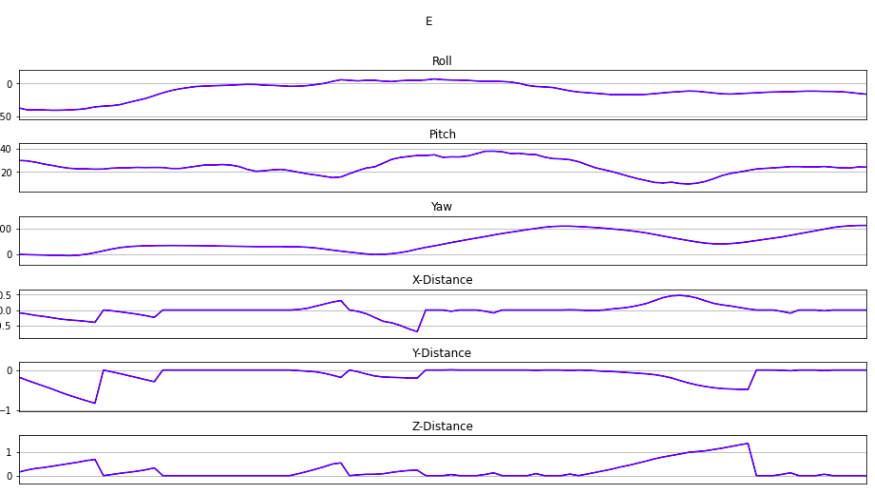
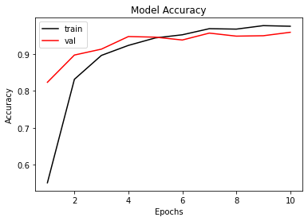
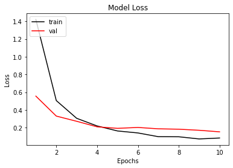
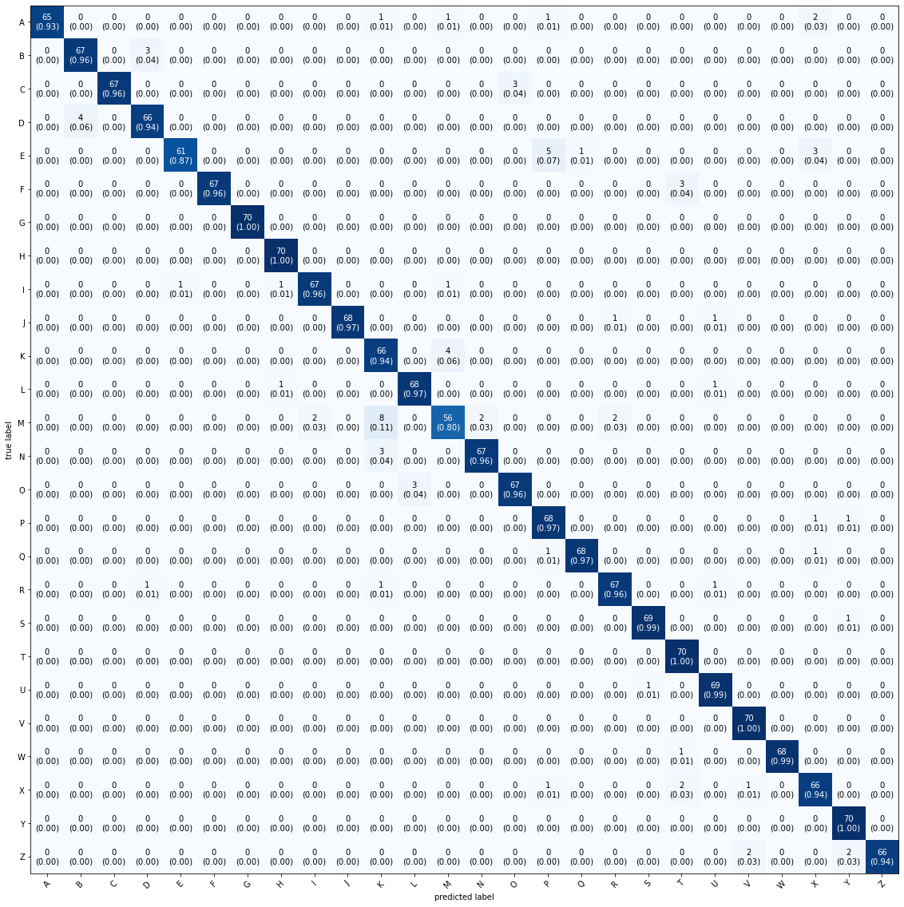

# About

This project combines 3D hand orientation detection using MPU-9250 sensor from my [3D-hand-orientation](https://github.com/danijelcamdzic/3D-orientation-detection) repository and custom algorithms for position and distance tracking to recognize air-written letters, utilizing a 2D convolutional neural network trained on a self-collected dataset.

# Overview

The project uses the MPU-9250 sensor to track the position and distance covered while a user is drawing a letter in the air. A custom algorithm collects this data and trains a 2D convolutional neural network for letter recognition. The repo includes the collected database, a Processing 3 script for database creation, and a Jupyter Notebook for implementing and training the neural network.

# Features

- 3D hand orientation detection and tracking using MPU-9250 sensor
- Custom algorithm for position and distance data collection
- Self-collected database of air-written letters
- `base-builder.pde` Processing 3 script for database creation
- `air-written-letter-recognition.ipynb` Jupyter Notebook for 2D convolutional neural network implementation and training

# Database Building

To build a new database of letters, it is necessary to run the database builder script for each letter and have it run for a couple of minutes. In those couple of minutes you should be drawing one letter only. 

The algorithm for recognizing letters assumes each letter will be drawn in the air starting from the top of the letter and going down (in direction of the force of gravity).

Figure below depicts signals gathered from the drawing of the letter E.



# Results

Figures below show the model accuracy and loss after training.




Figure below represents the results of each letter in the database.



# Getting Started

1. Clone the repository:
```bash
git clone https://github.com/danijelcamdzic/air-written-letter-recognition-system.git
```

2. Set up the development environment:
- Install Processing 3 for database creation
- Install Python and Jupyter Notebook for neural network implementation and training

3. Run the `base-builder.pde` script in Processing 3 to create the database.

4. Open the `air-written-letter-recognition.ipynb` file in Jupyter Notebook and follow the instructions to train the 2D convolutional neural network.

# Included Files

- `database.txt`: Collected database of air-written letters
- `base-builder.pde`: Processing 3 script for creating the database
- `air-written-letter-recognition.ipynb`: Jupyter Notebook file for implementing and training the 2D convolutional neural network

